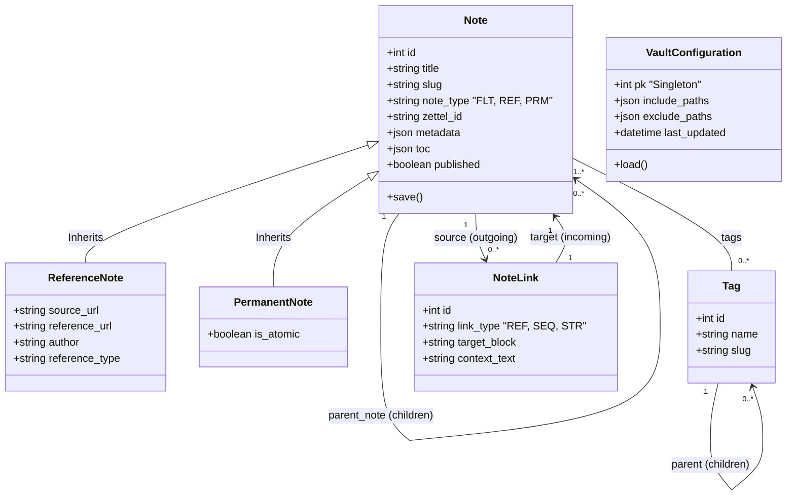

# 03 - Data Models & Zettelkasten

Sistemin merkezinde yatan tablo yapıları, Obsidian'ın yapısına ve Zettelkasten prensiplerine uygun tasarlanmıştır.

## 🏗️ Mimari Şema

## 📜 Modeller

### 1. Note (Temel Model)
Tüm `.md` dosyalarının baz aldığı nesnedir.
- **note_type:** `FLEETING`, `REFERENCE`, `PERMANENT`.
- **content_raw / content_html:** İşlenmemiş Obsidian metni ve Web'e hazır HTML.
- **zettel_id:** Benzersiz kimlik tanımlayıcısı (UUID + Date).
- **toc:** İçindekiler tablosu (headers `#{1,6}`).
- **tags / parent:** ManyToMany tag bağlantıları ve hiyerarşi dizilimi.

### 2. Reference Note (Note'dan türer)
Kitap, makale vb. dış referansları depolamak için kullanılır. `source_url`, `reference_url`, `author`, `reference_type` bilgilerini barındırır.

### 3. Permanent Note (Note'dan türer)
Bağımsız, spesifik ve kalıcı fikirleri temsil eder. `is_atomic` durumunu saklar.

### 4. Tag
Notların içerisinde geçen etiketleri temsil eder. Kendi içinde hiyerarşiktir (Parent > Child).
    
### 5. NoteLink (Edge / Bağlantılar)
Görsel Obsidian Graf'ının yapısını tutan temel sistemdir.
- **source / target:** Bağlantının çıktığı kaynak ve gittiği hedef.
- **link_type:** Genel Referans (REF), Sequence (SEQ), MOC (STR).
- **target_block:** Spesifik bir başlığa referans verilmişse tutulur (`#heading`).
- **context_text:** Linkin içerisinde geçtiği cümleyi (Backlinks / Linked Mentions) barındırır.

### 6. Vault Configuration
Hangi sistem klasörlerinin işleneceğini belirleyen Singleton modelidir (`include_paths`, `exclude_paths`).